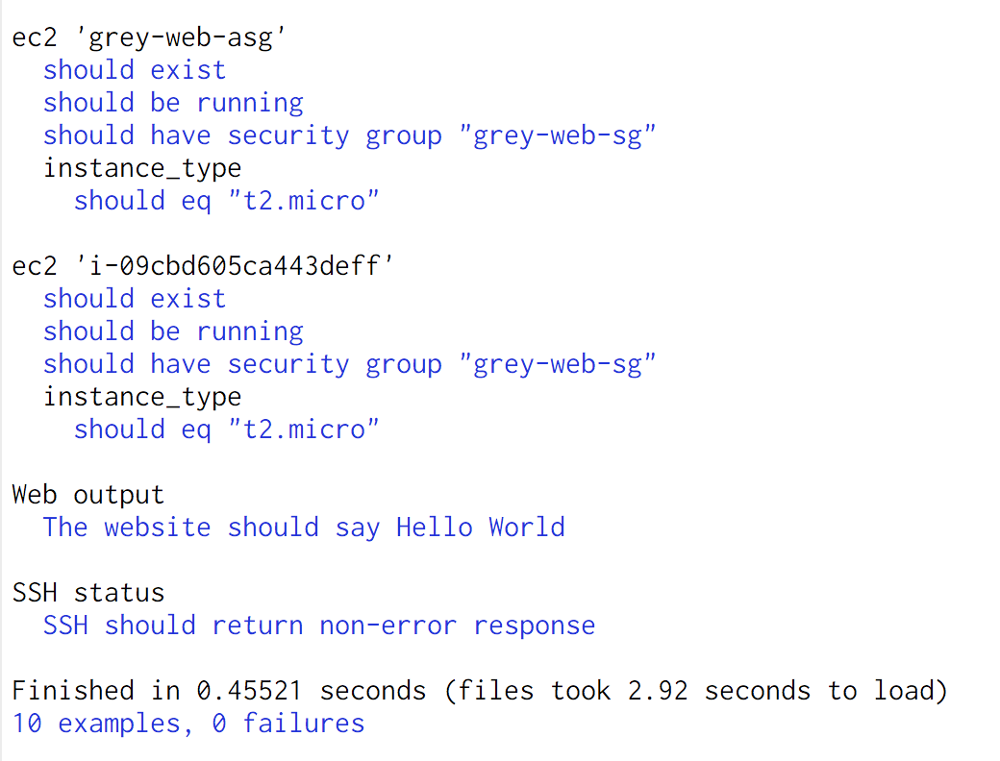

# Tests

No changes should be merged to master without passing the integration tests.

# Setting up

1. install AWS CLI - https://aws.amazon.com/cli

2. run `aws configure` for region put `ap-southeast-2`

3. install Bundler - http://bundler.io

4. run `cd tests && bundle install && cd ..`

# Running tests

run `./tests/run_tests.sh`

</img>
